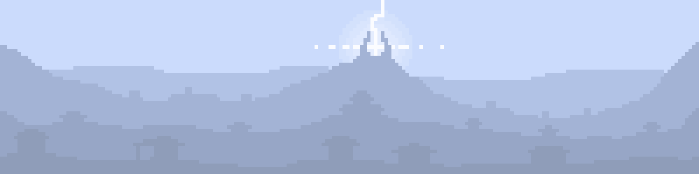

# Uncharted lands

## Описание
Небольшая разработка пошаговой градостроительной стратегии.
Подробное описание будет после создания основного каркаса проекта.

**[Подробный дизайн документ](design_document/MAIN.md)**

**[Дорожная карта проекта (в разработке)](updates_log/ROADMAP.md)**

**[T R E L L O](https://trello.com/b/Oc5zg2XV/uncharted-lands)**
## Обновления
**Статус:** проектирование\
**Версия:** 0.0.7

**[Полный список обновлений](updates_log/README.md)**
### Последние изменения
- **В связи с крупным рефакторингом проекта возможны изменения старых функций (их нейминга и функционала). В данный момент ведётся написание документации по проекту, которая упростит поиск информации по работе тех или иных модулей.**
- Изменена структура описания репозитория.
- Добавлена дорожная карта (пока в разработке).
- Начата работа над дизайн-документом (базовая версия уже на гите).
- Начат переход из библиотеки json в библиотку Pydantic (из-за бОльшоего функционала и удобства использования)
- Крупные изменения архитектуры, которые сделают движок более гибким для дальнейшей настройки. Изменения сразу будут отображаться в дизайн документе, чтобы было проще разбираться в архитектуре проекта.
- Генерация приобретает основные очертания, но будет видоизменяться в процессе рефакторинга и написания дизайн-документа.
  - Добавлена функция генерации пустого шаблонного словаря карты по заданным параметрам `main_world_generator`.
  - Добавлена функция генерации параметров глобальной карты `world_map_local_params`.
- Добавлен класс `Loop` для обработки событий экрана в отдельном классе. Теперь необходимо лишь создать его экземпляр и передать словарь функций и кнопок.

## Установка
- Инициализируем локальный репозиторий и скачиваем проект:
    ```bash
  git init
  git clone https://github.com/woodenowl/uncharted_lands.git
    ```
- Переходим в каталог с проектом и создаем виртуальное окружение:
    ```bash
  cd uncharted_lands
  python -m venv venv
  venv/Scripts/activate
    ```
- Устанавливаем пакеты:
    ```bash
  pip install -r requirements.txt
    ```
- Запускаем ```main.py```
- Готово
## Работа с проектом.
Информация для тех, кто имеет желание и время вкладываться в развитие проекта.
<details>
<summary>развернуть</summary>
 
  ### Создание своей ветки
  - Создаём свою ветку.
    ```bash
      git branch your_name
    ```
  - Переключаемся в неё.
    ```bash
      git checkout your_name
    ```
  - **Дальнейшие ```push``` и ```pull``` делаем ТОЛЬКО в неё !**
  ### Работа с веткой
  - Загружаем изменения из основной ветки.
    ```bash
      git pull origin dev
    ```
  - Загружаем изменения из своей ветки.
    ```bash
      git pull origin your_name
    ```
  - Выгружаем изменения в свою ветку.
    ```bash
      git push origin your_name
    ```
  ### Выгрузка изменений в основную ветку.
  - После внесения изменений в свою ветку создаём ```Pull requests```:
    - Переходим в [Pull requests](https://github.com/woodenowl/uncharted_lands/pulls).
    - Нажимаем ```New pull request```.
    - Выбираем свою ветку.
    - Пишем комментарий по проделанной работе и указываем меня в ```Reviewers```.
    - Нажимаем ```Create pull request```.
  - Ожидаем проверки изменений (может уйти от нескольких часов до суток. Зависит от свободного времени).
  - После создания ```Pull requests``` и до его подтверждения не делаем ```push``` в эту ветку.

</details>

## Стек технологий
**Функционал**
- *python* 
  - [numpy, os]
- *json*
  - [Pydantic]

**Отображение**\
pygame


## Контакты
- [Telegram](https://t.me/snowfox_x)
- mail: il.nordsky@gmail.com
- [vk](https://vk.com/ilnord)

## Лицензия
[BSD 3-Clause](https://choosealicense.com/licenses/bsd-3-clause/)
